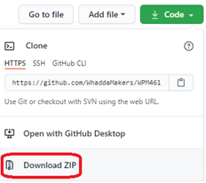
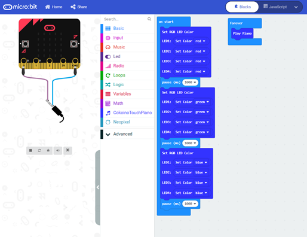

# Whadda piano shield for micro:bit (WPSH455)

This example shows enables you to play tunes on your micro:bit pianso shield!


## Extensions used
* CokoinoTouchPiano

## Running the example

1. Download the example program by clicking the “**Download ZIP**” link in the “Code” menu:
   
   

2. Unzip the downloaded file
3. Go to [makecode.microbit.org](https://makecode.microbit.org/) and start a new project
4. Drag the ```example_code.hex``` that is located in the folder you unzipped to the empty makecode blocks workspace. The sample code blocks should appear on your screen:
  
5. Download the code to your micro:bit

## Additional information
  For more information about theWhadda RGB LED ring shield for micro:bit (WPSE475), check the manual available at [whadda.com](https://whadda.com) 